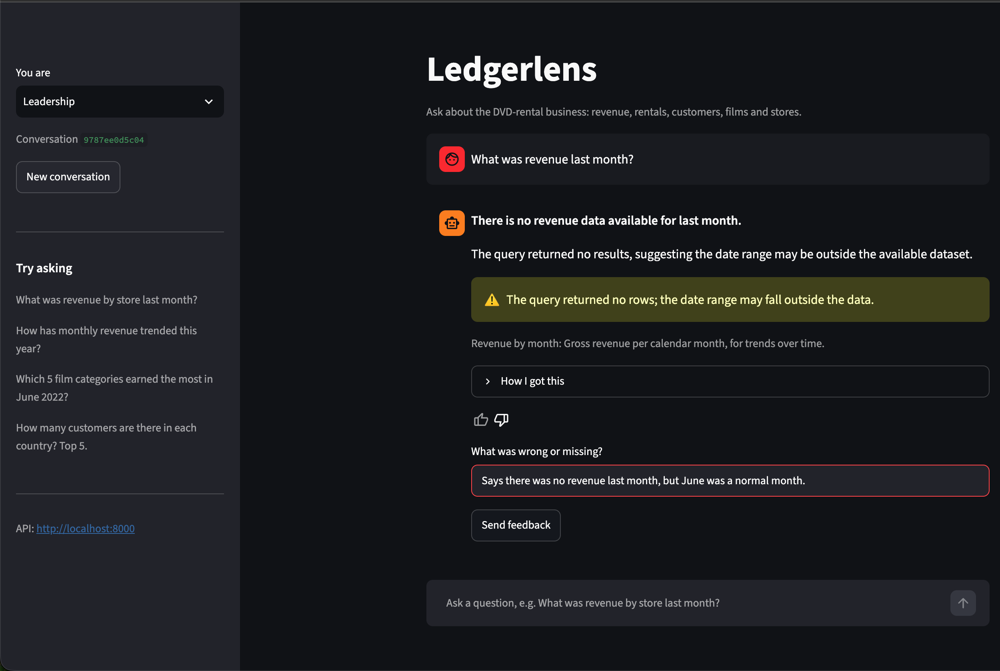
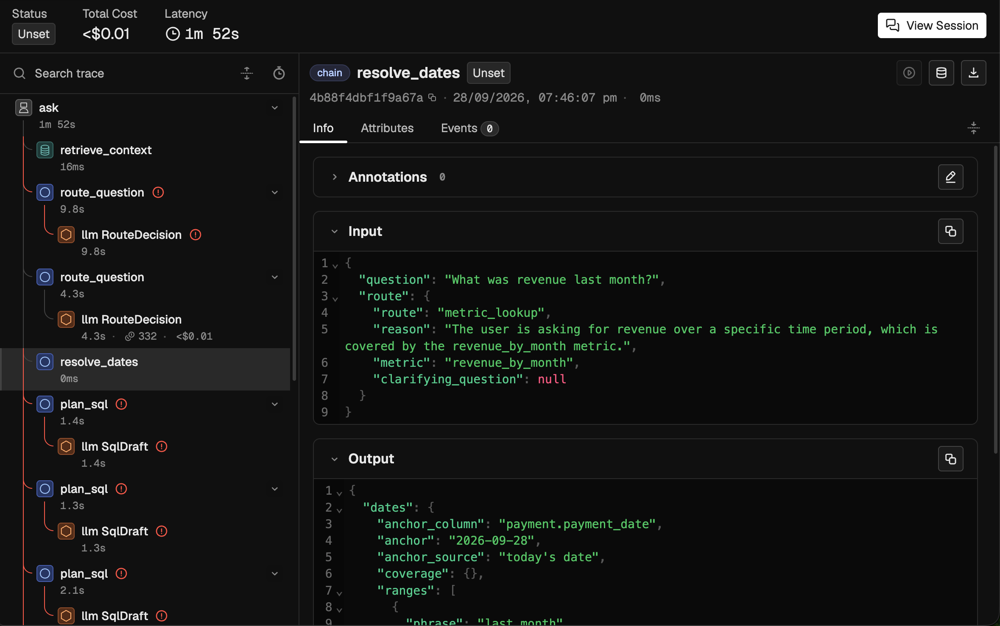
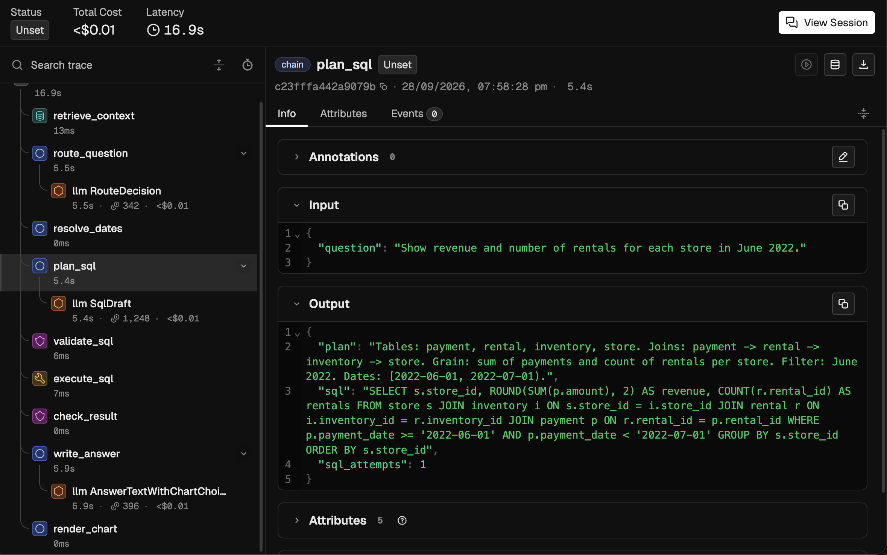

# Findings

Five failure modes were designed into v1 of the agent, each from a realistic cause (see
[README](README.md#failure-modes)). This is what actually happened when it ran on
Gemini 3.1 Flash-Lite: what a business user saw, what the trace showed, the root cause, the
fix, and the before/after from the golden-set evals. Three reproduced as designed, one
reproduced as a different bug than intended, and one did not reproduce.

Everything below comes from real runs. Run ids refer to `runs/<run_id>/run.json`; traces open
at `http://localhost:6006/redirects/traces/<trace_id>` on a machine that ran them.

| Failure mode | Reproduced? | v1 (eval cases passed) | v2 |
|---|---|---|---|
| `date_boundary` | yes | 0/3 | 3/3 |
| `fanout_join` | as a different grain bug | 0/2 | 2/2 |
| `wrong_route` | yes, for questions that look answerable | 2/3 | 3/3 |
| `skipped_visualisation` | yes, once the prompt framed it as a product rule | 0/3 | 3/3 |
| `hallucinated_column` | no | 0/3 (answers right, charts missing) | 3/3 |
| **All 20 cases** | | **7/20** | **20/20**, no regressions |

Reports: [v1](evals/reports/20260928T141239_v1.md), [v2](evals/reports/20260929T071842_v2.md),
[comparison](evals/reports/20260929T072346_compare_v1_vs_v2.md). v2 was run three times: the first two runs (19/20 each) each
caught a real bug that was fixed before the next run ([section 6](#6-regressions-the-evals-caught-in-v2));
20/20 is the run on the final code. Two of v1's failures were model-API errors (Gemini 503
"high demand"); one of those runs had already routed a vague question wrongly before it crashed.

---

## 1. `date_boundary`: "last month" meant last month on the server's clock

**What the business user saw.** Leadership asked *"What was revenue last month?"* and got
*"There is no revenue data available for last month."* June 2022 had $10,923.45. In the same
eval run: *"Zero customers have rented something in the last 7 days"* (598 had) and an empty
answer to *"How has monthly revenue trended this year?"*. The user gave the first one a 👎
with *"Says there was no revenue last month, but June was a normal month."*

**What the trace showed** (run `20260928T141548-b21433`):
- `ask`: the 👎 sits on the root span as a `user_feedback` annotation, score 0.
- `resolve_dates`: `anchor = 2026-09-28`, `anchor_source = "today's date"`. This is the cause.
- `plan_sql`: *"Filter: payment_date for August 2026. Dates: '2026-08-01' to '2026-09-01'."*
- `execute_sql`: `row_count: 0`.
- `check_result`: warning `empty_result`. v1 still turned it into a confident "no revenue".

**Root cause.** `resolve_dates` anchored relative dates to `date.today()`. The data ends on
27 Jul 2022 (payments) and 23 Aug 2022 (rentals).

**Fix.** Anchor to the latest date of the metric's time column, give the model the data's
coverage, and state the resolution in the answer: *"last month = 1 Jun 2022 to 30 Jun 2022
(latest data: 27 Jul 2022)"*. See `ledgerlens/agent/nodes/resolve_dates.py`.

**Eval evidence.** v1 0/3 → v2 3/3.

---

## 2. `fanout_join`: two facts, one filter

Designed as a fan-out: a join that multiplies payments and inflates revenue. In practice v1
never inflated anything. It failed differently, and consistently: whenever a question needed
both payments and rentals, it counted rentals *through* the payments.

**What the business user saw.** *"Show revenue and number of rentals for each store in June
2022"* → *"Store 1 generated $5,551 from 1,305 rentals"*. The revenue is right; 1,121 rentals
were made at store 1 in June. For July by category: *"Sports leading at $762.29 across 171
rentals"*, against 498.

**What the trace showed** (run `20260928T142822-aec462`): `plan_sql` joined
`payment → rental → inventory` and filtered only on `payment_date`, so
`COUNT(r.rental_id)` counted rentals *paid for* in June, not rentals *made* in June. Every
later span passed: the SQL was valid, nothing was multiplied, the numbers looked plausible.
In an earlier isolated run, v1 filtered on both dates at once and got $864 instead of
$5,551.

**Root cause.** The v1 planner prompt had no grain rule. Each fact has its own date:
revenue belongs to `payment_date`, rentals to `rental_date`.

**Fix.** A planner rule (v2 `plan_sql.md`, rule 3): aggregate each fact in its own CTE,
filtered on its own date column, then join the CTEs. For true fan-outs, `check_result`
compares joined rows with distinct payments; an integration test proves it catches a
deliberately bad join.

**Found on the way.** The golden set's ground-truth SQL for these cases (the CTE pattern the
fix asks for) was rejected by the validator as "unbounded": it only accepted a `LIMIT` or an
aggregate on the outer query. v2 would have wasted a retry on every two-fact question. The
validator now accepts queries that read only from aggregated CTEs.

**Eval evidence.** v1 0/2 → v2 2/2.

---

## 3. `wrong_route`: confident answers to vague questions

**What the business user saw.** *"How did we do last month?"* → *"$10,923 in revenue across
2,654 rentals"*. Revenue and rentals were the agent's guess at what "how did we do" meant,
and it didn't say so.

**What the trace showed.** `route_question` output `route: metric_lookup`; its LLM span shows
the v1 prompt line *"People want numbers, not questions back, so try to answer every question
with data."*

**Worth knowing.** Obviously vague questions (*"Is the business healthy?"*, *"Which store is
doing better?"*) were still clarified by v1. The failure needs a question that looks
answerable. Routing also varied between runs: v1 sent *"Predict how many rentals we will have
next month"* to SQL in one eval run and correctly refused it in the next.

**Fix.** v2 `route.md`: what counts as vague, *"a confident answer to a question nobody asked
is worse than a short question back"*, and examples (distinct from the eval questions).

**Eval evidence.** v1 2/3 → v2 3/3.

---

## 4. `skipped_visualisation`: trends without charts

**What the business user saw.** Monthly trends came back as plain tables.

**What the trace showed** (trace `af1a22324ee75e9666e3b1b912c07ded`): `render_chart` ran
after the answer, with input `chart_requested: false`, set by the answer step. Output:
`table`.

**Root cause.** In v1 the answer step decided whether to chart, and its prompt said charts
clutter the chat, so only include one when the user asks.

**Worth knowing.** A softer first version of that prompt (*"only if a chart is essential"*)
did not reproduce the failure: the model judged a trend chart essential. It took an
instruction phrased as a product rule to make it skip charts.

**Fix.** Charting is a graph step before the answer, chosen from the data's shape. The first
v2 eval run then caught a gap in that chooser: a single row with a date column (revenue
"last month", grouped by month) came back as a table instead of a single figure. Fixed, with
a test.

**Eval evidence.** v1 0/3 → v2 3/3.

---

## 5. `hallucinated_column`: did not reproduce

v1 gives the model only the top 3 retrieved tables, with no join paths and no column check.
For *"How many customers are there in each country?"*, `retrieve_context` returned
`customer, address, payment`, with `city` and `country` missing. `plan_sql` joined through
`city` and `country` correctly anyway. Across 3 eval cases and 4 isolated tries, v1 never
invented a column.

The likely reason: Pagila is a port of MySQL's Sakila, one of the best-known sample schemas,
and the model knows it from training. **Truncated schema context is masked on a famous
schema and would bite on a private one**, which is where it matters. The fix (join-path
completion and a column check against `information_schema`) stays: it costs nothing and
removes the guesswork.

**Eval evidence.** v1 answered all 3 correctly (they failed only on missing charts) → v2 3/3.

---

## 6. Regressions the evals caught in v2

The fixed agent did not pass first time. Each v2 eval run surfaced one new problem, and each
was traced, fixed and covered by a test before the next run.

**Run 1 (19/20): a cross join.** For *"Who are our top 5 customers by lifetime value?"* v2
wrote `JOIN customer cu ON cu.customer_id = cu.customer_id`, a condition that compares a
column with itself, so every payment matched every customer. The answer told sales that each
of the top five was worth **$67,417**, which is total revenue. The fan-out check had fired
(*"16,049 payment rows became 9,613,351 joined rows (599.0x)"*) and the warning reached the
answer, but the headline still led with the inflated number. Fixes: the validator rejects a
join condition that compares a column with itself, and a fan-out now sends the SQL back to
the planner like a validation error; only when retries run out does the agent answer, with
the warning.

**Run 2 (19/20): a one-point line chart.** For *"How many rentals did each store have last
month?"* the numbers were right, but the query kept a `month` column holding a single value,
so the chart chooser drew two one-point lines instead of a bar chart. Fix: a date column that
never changes is a constant, not a time axis.

**Run 3 (20/20)** on the final code.

Worth knowing: runs of the same code differ (Gemini 3.1 Flash-Lite ignores temperature), and
the two failures above came from different questions in consecutive runs. One eval run is a
sample, not a verdict.

---

## Other things the traces and evals caught

- **Top-N overreach.** On *"Which film categories earned the most last month?"* the answer
  called Games "the lowest", but the query returned only the top 10 of 16 categories.
  `execute_sql` showed `row_count: 10`. v2 tells the answer step when a list is a top-N.
- **Wrong grain in v1.** *"Show the monthly number of rentals in 2022"* returned rows per
  store per month, and the answer reported per-store numbers as totals (*"a low of 92 in
  February"*, against 182). v2 returned monthly totals as a line chart.
- **Provider errors.** On the free tier, Gemini returns 503 "high demand" for minutes at a
  time. Each retry shows up as its own span, so a slow run explains itself. Retries count
  against the 500-requests-a-day cap, so they are now few and long (10 s, 20 s, 40 s), and
  an exhausted daily quota is never retried. The eval reports count provider errors apart
  from agent failures.

## Caveats

- 20 cases, and one run per version on the final code: read per-case results as evidence,
  not statistics.
- Latency is not comparable between the versions. v1 ran on 28 Sep during hours of Gemini
  503 overload (median 69 s per question); v2 ran on 29 Sep with the API quiet (median 15 s).
- v2 uses 54% more tokens for the same 50 model calls (45,934 against 29,773 for the 20
  questions). The longer prompts (grain rules, date coverage, routing examples) are the price
  of the fixes.
