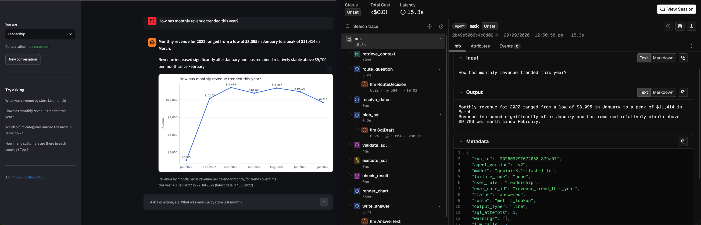
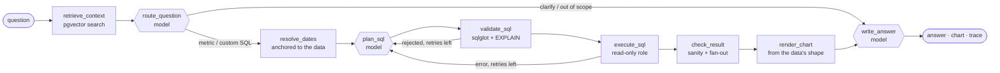

# ledgerlens

A text-to-SQL analytics agent that answers business questions about a DVD-rental business,
built so that every answer can be traced back to its cause. It reads curated metric
definitions before writing SQL, checks the SQL and the result deterministically, and records
every run as a trace a developer can open from a business user's 👎. A golden-set eval shows
whether a change made it better or worse: the repo ships the agent both as first built (v1,
five realistic failure modes) and fixed (v2).

**Demo video:** [watch the walkthrough on Loom](https://www.loom.com/share/5001144137a0448bbfeaa07169ed2cd7)



## How it works



Only the three hexagons call the model. Everything that can be checked is code:

- **Semantic layer first.** 14 curated metrics (definition, grain, canonical SQL, gotchas)
  and schema docs are embedded locally into pgvector. Retrieval adds the tables needed to
  join what it found, so the model never has to guess a join path.
- **Read-only by construction.** The agent connects as a role that can only `SELECT`, proved
  by `make db-check`: inserts, DDL, temp tables, a `SECURITY DEFINER` function and the staff
  password column are all denied, even with the session's read-only flag turned off.
- **SQL is validated before it runs:** one read-only statement, known tables and columns,
  bounded, then Postgres `EXPLAIN`. Errors go back to the model, up to two retries.
- **Results are sanity-checked:** empty or `NULL` totals, negative values, duplicate groups,
  and a fan-out probe that catches joins multiplying payments.
- **Relative dates resolve against the data**, not the clock ("last month" = June 2022), and
  the answer says how they were resolved.
- **Charts follow the data's shape** (single number, time series, categories, table).
- **Every run is traced and recorded.** OpenTelemetry spans in OpenInference conventions go
  to a local [Arize Phoenix](http://localhost:6006); `runs/<run_id>/run.json` keeps the full
  answer. See [docs/LOGGING.md](docs/LOGGING.md) for what is logged and what isn't.

## Quickstart (about 5 minutes)

Needs Docker with Compose v2, [uv](https://docs.astral.sh/uv/), and a free Gemini API key
from [AI Studio](https://aistudio.google.com/apikey).

```bash
cp .env.example .env      # paste your GEMINI_API_KEY
make up                   # Postgres 16 + pgvector with Pagila, and Phoenix (first start ~90 s)
make install              # uv sync
make seed                 # embed the semantic layer (local model, no API calls)
make ask Q="What was revenue by store last month?"
```

`ledgerlens ask` prints the answer, the chart path and a link to the trace. Then:

| | |
|---|---|
| `make api` | FastAPI on http://localhost:8000/docs: `POST /v1/ask`, `GET /v1/runs/{id}`, `POST /v1/runs/{id}/feedback`, `/health` |
| `make ui` | Streamlit chat on http://localhost:8501 (needs `make api`); `?run=<run_id>` opens a saved run |
| http://localhost:6006 | Phoenix: one trace per question, sessions, and 👍/👎 as `user_feedback` annotations |
| `make db-check` | proves the dataset is loaded and the agent's role cannot write |

**Model and cost.** Gemini 3.1 Flash-Lite on the free tier (15 requests/minute, 500/day).
A question costs three model calls; the agent rate-limits itself, retries overloads a few
times with long waits, and never retries an exhausted daily quota.

## Failure modes

`AGENT_VERSION=v1` is the agent as first built; `v2` is fixed. `FAILURE_MODE=<name>` puts a
single failure back into v2, e.g. `FAILURE_MODE=date_boundary make ask Q="What was revenue
last month?"`. Each is a realistic cause, never a hard-coded wrong answer; prompt-level causes
are the files in [`ledgerlens/agent/prompts/v1`](ledgerlens/agent/prompts/v1).

| Failure mode | Cause in v1 | Fix in v2 |
|---|---|---|
| `date_boundary` | relative dates anchored to the server clock | anchored to the latest date in the data, and stated in the answer |
| `fanout_join` | planner prompt has no grain rule; no fan-out check | aggregate each fact in its own CTE; fan-out probe |
| `wrong_route` | router told to "try to answer every question" | clarify rules and examples |
| `skipped_visualisation` | the answer step (told charts clutter chat) decides whether to chart | chart chosen from the data's shape by a graph step |
| `hallucinated_column` | top-3 tables only, no join paths; no column check | join-path completion and column validation |

What each one looked like to a user, what the trace showed, and the before/after numbers:
[FINDINGS.md](FINDINGS.md).

## Evals

20 golden questions ([`evals/golden.yaml`](evals/golden.yaml)), each with hand-written
ground-truth SQL that is run to get the expected values. Scoring is deterministic: answer
correctness (values compared with tolerance, independent of column names and order), route,
output type, SQL safety, retries, latency and tokens. Provider errors (a 503 from the model
API) are counted separately from agent failures.

```bash
make eval-v1        # every failure mode on
make eval-v2        # fixed
make compare        # metrics side by side, regressions first, every case that flipped
uv run python -m evals.rescore evals/reports/<report>.json   # re-score saved runs, no model calls
```

| | v1 | v2 |
|---|---|---|
| Cases passed | 7/20 | 20/20 |
| Answer accuracy (data cases) | 53% | 100% |
| Route accuracy | 95% | 100% |
| Output type accuracy | 50% | 100% |
| Regressions | | none |

v2 took three runs: the first two each caught a real bug (a self-comparing join that
inflated customer value 599x; a one-point line chart), fixed before the next run. Details,
and why latency isn't comparable between the two, in [FINDINGS.md](FINDINGS.md).

Reports: [`evals/reports/`](evals/reports).

## Repo map

```
ledgerlens/
  main.py, cli.py     FastAPI app factory; `ledgerlens` CLI (db-check, seed, ask)
  api/                routes (health, ask, runs + feedback), dependencies, error mapping
  schemas/            request and response models: the API contract
  services/           agent_service (one run = one trace + one run record), run_store, feedback_service
  agent/              LangGraph graph, state, nodes/ (one file per step), prompts/v1|v2,
                      failure_modes, tracing, the model factory
  semantic/           metrics.yaml, schema.yaml, local embeddings, pgvector retrieval, seed
  sql/                validator, executor, sanity checks, relative dates, catalog
  viz/                output-type chooser and the chart house style
  core/               settings, logging, OpenTelemetry setup
ui/app.py             Streamlit chat, a thin client over the API
evals/                golden set, runner, scoring, reports, comparison, rescore
db/                   Pagila fetch script (pinned + checksummed); init SQL for pgvector and the read-only role
tests/                unit (no database, no model) and integration (skipped unless `make up`)
docs/                 LOGGING.md; img/ holds the screenshots
```

`make test` runs everything; `make lint` runs ruff.

## Notes

- **Tracing backend.** Traces go to Phoenix locally. Because the spans are plain
  OpenTelemetry, `NEATLOGS_API_KEY` adds a second exporter to Neatlogs over OTLP/gRPC as
  their docs describe (`uv sync --extra neatlogs`). It is untested: I couldn't create an
  account.
- **Data.** [Pagila](https://github.com/devrimgunduz/pagila) (c) Devrim Gündüz, MIT-style
  licence, fetched at a pinned commit with checksums by `db/fetch_pagila.sh`; not vendored.
  No real company or customer data is used anywhere.
- **Gemini free tier.** Requests may be used by Google to improve its products, which is fine
  for this public sample data and would not be for real customer data.

## What could be improved

- **Conversation memory.** `session_id` only groups traces, so a follow-up like "and for
  store 2?" is answered as a new question. Next: pass the previous question and SQL into
  routing and planning.
- **Check the prose, not just the data.** The evals compare the query result with the ground
  truth, but the model writes the headline's numbers from that result and could misstate
  one. Next: check that every number in the headline appears in the result.
- **More eval runs.** 20 cases and one run per version on the final code, while the model
  can write different SQL from one run to the next. Next: run each case several times and
  report how often every run passes.
- **Wider checks.** The fan-out probe skips queries that read from CTEs or subqueries, and
  relative dates cover common phrases only ("last 2 quarters" isn't recognised).
- **From 👎 to test case.** Flagged runs become golden-set cases by hand. Next: one command
  that turns a flagged run into a draft case to review.
- **Non-blocking requests.** `POST /v1/ask` holds the connection for seconds, up to a minute
  when the free tier is overloaded. Next: run questions in the background and stream progress
  to the UI.
- **Production plumbing.** No authentication, run records live on local disk, and the
  Neatlogs exporter is untested.
